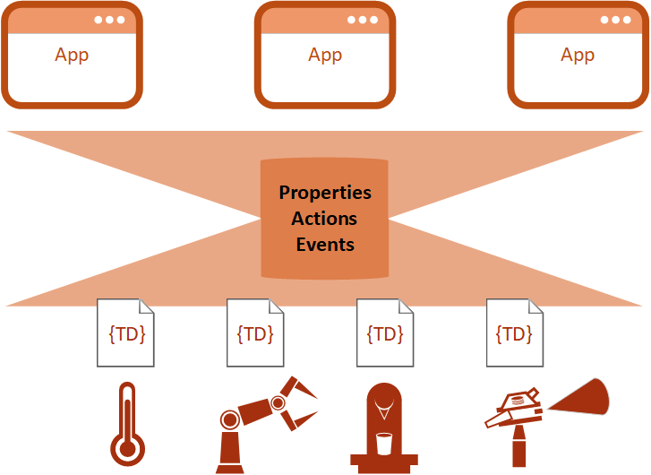
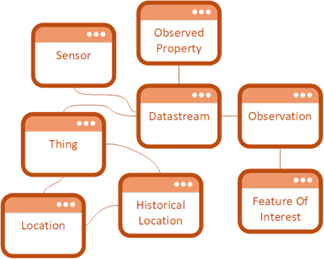
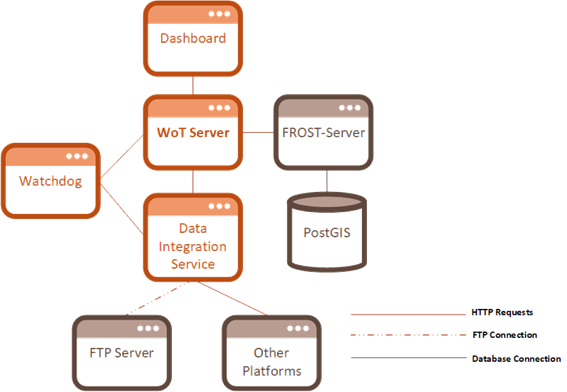
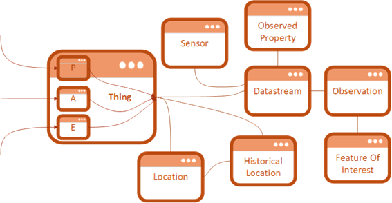
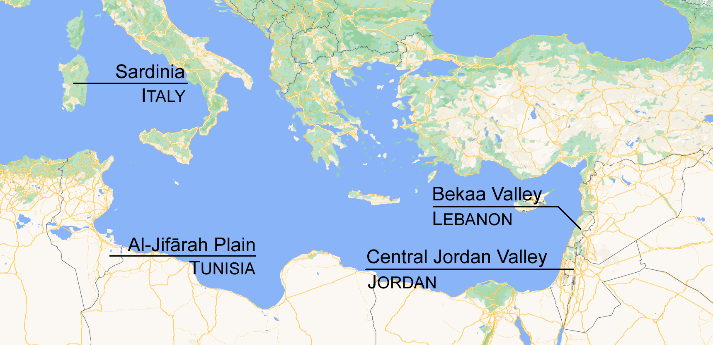

# Summary
This document presents WoT-Server, a JavaScript IoT server that combines the abstraction  of the Web-Of-Things Standard and the data model of the SensorThings Standard to provide a simple interface for storing and requesting data in timeseries format. WoT-Server provides simplified access to the different instances required for organised storing of IoT timeseries data via easily accessible HTTP endpoints, which can also be adapted to be accessed with different protocols such as CoAP and MQTT.
This paper describes the concepts and the techniques used in the development of this tool. It also shows how to use it in a water management/irrigation application, presenting the original use case developed in the ACQUAOUNT project [@acquaount2024], a project funded by the European Union with the objective of providing tools for efficient use of water.

# Statement Of Need 
WoT-Server was created as a centralised data management solution for the ACQUAOUNT Project. One of the objectives of the ACQUAOUNT Project is providing smart irrigation recommendations to farmers using a water balance model. This model takes as input timeseries data of different properties of the specified field, such as temperature, soil moisture and wind speed, and calculates the best date and amount of irrigation. WoT-Server was developed as a standardized API to allow easy access to faming/water management data for further model implementation and to homogenize the data management in a fog & cloud environment simplifying the upload, storage and retrieval procedures of measurements from sensors in the field. WoT-Server is capable of both receiving data via an HTTP endpoint or fetching the data itself from other API services, a feature useful for centralising data from multiple platforms.  
Since it was needed that users and developers could interact with the platform easily and consistently, WoT-Server follows the Web-Of-Things standard. This standard provides a common framework for describing and accessing connected devices and services through Thing Descriptions, enabling a uniform interface for interaction regardless of device type or communication protocol. In addition, to simplifying user interaction, WoT-Server also needed a well-defined data model to store and organise its sensor data. For this purpose, the platform uses the OGC SensorThings standard as the database structure, which provides a standardised model for representing IoT entities such as Things, Sensors, Properties, and Datastreams, along with their timeseries Observations. Using SensorThings ensures that all data stored in WoT-Server follows a consistent and extensible structure, making it easier to query, analyse, and share.  
All AI-based applications require data, and most if not all IoT applications obtain this data from sensors in timeseries format. The aim of WoT-Server is to provide a platform to easily manage this type of data with minimal setup and configuration required, letting users focus on the tasks specific to their use case. With WoT-Server, all developers creating IoT applications can have a platform where they can store their data up and running in minutes, which they can use to create AI models.

# Definition Of Standards Used
## WoT
The Web-Of-Things (WoT) standard is a tool that provides a set of standardized technology building blocks used to simplify the IoT environment for the developers navigating it. The first step of abstraction of WoT is dividing all the interactions of a Thing with the physical world into three different categories, called interaction affordances. A Thing can be anything that is an object of the physical world (any physical thing) or the information world (a virtual thing), and an interaction affordance can be a property, an action, or an event. [@w3c2024]  
- A Property affordance is a value available to be read or written from either the device or the physical world, such as the temperature (which is read from the physical world) or configuration parameter of the device (which can be read or written from another device).  
- An Action affordance allows other devices to invoke an action by the device, which may or may not interact with the physical world, such as brewing a coffee for a smart coffee machine or starting the process of communicating with another device.  
- Finally, an Event affordance is used to observe events that can occur in the device, such as a door being open or a cooking machine running out of some ingredient.  
All the metadata of a device and all its interaction affordances are documented in a Thing Description (TD), and something described by a TD is considered a Thing. This file is in JSON-LD format and includes all the data required to use the defined Thing except the network protocol, so that the same TD can be reused over different protocols such as HTTP, MQTT, or others. The protocol is provided using the WoT Binding Template. [@kaebisch2024]  

{label="figure1"}

Taking a look at \ref{figure1}, it is seen how providing a uniform interface for objects facilitates the tasks of the IoT applications, simplifying the connections and creating easily maintainable and expandable applications. What \autoref{figure1} is  
Combining the information given through the TD and the Binding Template, a Thing can be successfully accessed and used. The TD provides all possible endpoints for the interaction affordances and defines the required parameters and body of the message, and the Binding Template defines the protocol.  

## SensorThings
The SensorThings standard is an IoT standard that provides an open and unified way to connect IoT devices, data, and applications over the web. The SensorThings standard splits its functionality into two different parts: The Sensing part and the Tasking part. The Sensing part allows IoT devices and applications access to a data model so they can create, read, update, and write IoT data and metadata in a SensorThings service through HTTP requests, while the Tasking part is used to schedule actions to be performed to allow the IoT device to interact with the physical or virtual world. The Tasking part is not relevant for this solution.  
The Sensing part is centered around the SensorThings Data Model, seen in Figure 2.  

  

The Data Model itself is centered around the Datastream concept. A Datastream represents the flow of data from a Sensor connected to a Thing, measuring a specific ObservedProperty. A Sensor, by definition, is an instrument that observes a property or phenomenon, but it can observe more than one. The property that is being observed and its metadata, is stored in the ObservedProperty entity. Finally, the Thing entity refers to the physical thing that is being observed. This Thing is related to a Location, and if it has been moved, it keeps track of all the HistoricalLocations.  
A combination of an instance of each of these three entities (Thing, Sensor, and ObservedProperty) creates a Datastream since they are required for the combination to be unique. Then, each unique Datastream has a series of Observations. While the Datastream represents the abstract flow of the data and doesn’t contain values, an Observation represents the value of the property being observed in the Datastream at a certain point in time, therefore it contains one value. Each Observation consists of a value being assigned to a phenomenon which is a property of the FeatureOfInterest of the Observation. [@liang2024]  

# Design And Implementation
The platform, according to the requirements of the project, must consist of an API implementation based on WoT descriptions that controls the heterogeneity of the different sources of data (such as different types of in-situ sensors or different weather stations) by providing a common data exchange model. This solution attacks one of the previously mentioned problems of IoT, the platform fragmentation, and defines how a sensor should communicate its data to the platform.  
To provide all the required functionalities of the project in a clean, scalable, and efficient manner, the platform is divided into multiple services, all of them virtualized and deployed using Docker. A basic version of the different services and their connections can be seen in Figure 3.  

  

The main service is the WoT server, developed using node-wot [@eclipsethingweb2024]. This service provides all the endpoints and the controllers that handle the requests sent by the sensors and the gateways. To provide persistent storage of the data, a PostGIS database is used. However, to simplify the development process and to maintain consistency with the standards, FROST-Server, a SensorThings compliant server, is used to access the database [@fraunhofer2024]. Then, a different service is used to integrate data from external platforms into the WoT platform, either by directly requesting it to the external platform or by fetching it from an FTP server where it has been uploaded. In addition, the watchdog service is used to control if the server and the data integration service are online and haven’t crashed and gone offline. If this happens, the watchdog sends an email to the server administrator to restart the service as soon as possible to avoid missing out on data being sent from the sensors. Finally, the monitoring platform provides a simple way to check if data is correctly being uploaded to the server.  
Inside the WoT server, it was decided that the best course of action would be to define Things in the platform as the closest possible match to a physical location. Since in the use case most of the data is meteorological and its purpose is to generate predictions to achieve a better use of water, it does not make a lot of sense to combine data from different locations, even if they share some characteristics such as the type of crop, or are owned/cultivated by the same farmer (as is the case in farms with large amounts of terrain or with terrains in different locations), because many characteristics such as rainfall, altitude, steepness, closeness to other water sources, and many more, can affect this prediction.  
Each physical location can be interacted with by following the WoT protocol, with the following interaction affordances:  
- (field/station/item)Information: Provides some static information about the field/station/item of this thing.  
- propertiesList: Provides a list of all the properties being observed at this field/station/item.  
- propertyInformation: Provides detailed information about one of the properties.  
- datastreamsList: Provides a list of datastreams in the field/station/item. A datastream is the flow of data defined by the combination of a Thing, Sensor, and Property.  
- datastreamInformation: Provides detailed information about one datastream.  
- datastreamLastMeasure: Provides the last measure taken in a specified datastream.  
- datastreamMeasures: Provides all the measures taken in a specified datastream.  
- lastMeasures: Provides the last measures taken in all datastreams.  
Some types of items also have the following properties:  
- sensorsList: Provides a list of the sensors in this field/item.  
- sensorInformation: Provides detailed information about one of the sensors.  
All types of things have available at least this action affordance, used to upload data to the platform.  
- receiveMeasure: Used as an endpoint for the sensors to upload data to the platform.  
Finally, all types of Things have the same event affordance, which can be subscribed to, in order to perform an action every time it triggers.  
- newObservation: This event is triggered every time there is a new measure in the system.  
The Binding Templates defined inside the thing descriptions describe how to interact with the interaction affordances. For properties, they can be read using a GET request and request parameters, for actions, they can be invoked using a POST request and request body, and special clients can subscribe to events with a special handshake.  
These interaction affordances act as a bridge between the user and the data stored in the SensorThings database. Since the WoT model and the SensorThings model share the Thing as a common instance, they can collaborate to create a model that is complete and detailed but abstract and simple to interact with at the same time, as seen in Figure 4.  
 
  

In addition to the data uploaded to the platform through the sensors, the WoT platform also takes data from external sources into consideration by using a data integration service to fetch data from those external platforms and upload it into the WoT Server so that it can be queried and used like any other sources of data.  
The final service to be implemented is the monitoring platform. This simple dashboard accessible through a browser is used to query and export data using a visual user interface, useful for testing purposes and visual displaying of data.  

# Use Case

WoT-Server has been developed as one of the core tools of the ACQUAOUNT Project, a project funded by the European Union via the PRIMA program and supported by Horizon 2020, with the objective of developing a variety of innovative tools focused on making the use of water at farm level and basin level as efficient as possible. These technologies are developed and tested in 4 areas of the Mediterranean area (Sardinia, Italy; Bekaa Valley, Lebanon; Al-Jifārah plain, Tunisia; Central Jordan Valley, Jordan), seen in the map in Figure 5.  

  

The ACQUAOUNT Project has many lines of research and development, such as sensor installation, LoRaWAN networks, or basin modelling. WoT-Server acts as the link between the sensors and platforms and the models, storing data and providing functionalities in a standardized way. WoT-Server stores the data received from the data sources and provides it to services that calculate recommendations based on this data. Once the services finish the calculations, the results are also stored in WoT-Server to be consumed by the dashboard and frontend services to be displayed to the final users in a graphical and understandable way.  
As mentioned previously, in this specific use case, Things have been defined as the closest match to a physical location, to maximize the accuracy of meteorological data. This has resulted in three different Thing Types; Fields, Weather Stations and Basin Resources. Since basins are large physical locations, they are represented as multiple things. The Fields and Basin Resources are used as testing grounds in accordance with the farmers or institutions that own the land, with sensors being installed on the fields. Each sensor can measure multiple properties, or different variations of the same property (for example, a probe that can measure the soil humidity at multiple depths), which means that for each sensor and property there can be multiple datastreams. The Weather Stations function similarly but the ACQUAOUNT Project does not control which sensors are installed.  
These datastreams can include properties of the land, such as soil moisture or temperature, of the air, such as humidity, or the weather, such as rainfall or wind. Combining the data obtained from these datastreams plus a medium range weather forecast (7 to 30 days), the models can calculate a recommended irrigation date, a late irrigation date, and a limit irrigation date, that the farmer can choose to follow.  

# References